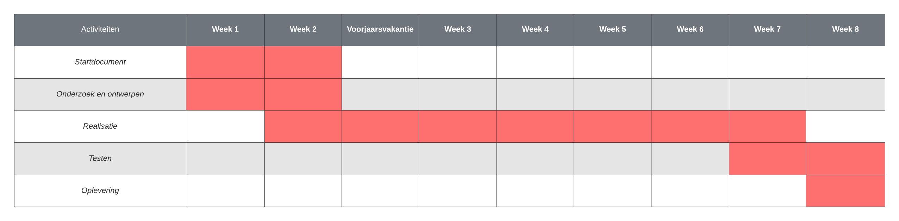

# Startdocument Design patterns - Budgettracker applicatie

Startdocument van **Monique Sabong**, **Rick Vinke** en **Thijs Janse**.

## Applicatie Beschrijving

Voor het vak design patterns wordt er een budgettracker applicatie gerealiseerd. De applicatie moet als hulpmiddel dienen
om overzicht te houden financiële inkomsten en uitgaven. 

De applicatie zal ontwikkeld worden met **Java en Kotlin**.

## MosCow analyse

## Klassendiagram

## Planning

Om de voortgang van dit project te bewaken, is er een planning gemaakt. Deze planning bevat in grote lijnen hetgeen waarmee wij ons bezig zullen houden per week tot de deadline. Er kan natuurlijk afgeweken worden van deze planning, maar het is het doel om deze in grote lijnen te volgen.

Dit project is begonnen op maandag 5 februari 2024 en zal eindigen op vrijdag 4 april 2024.

## Literatuurlijst

- 
