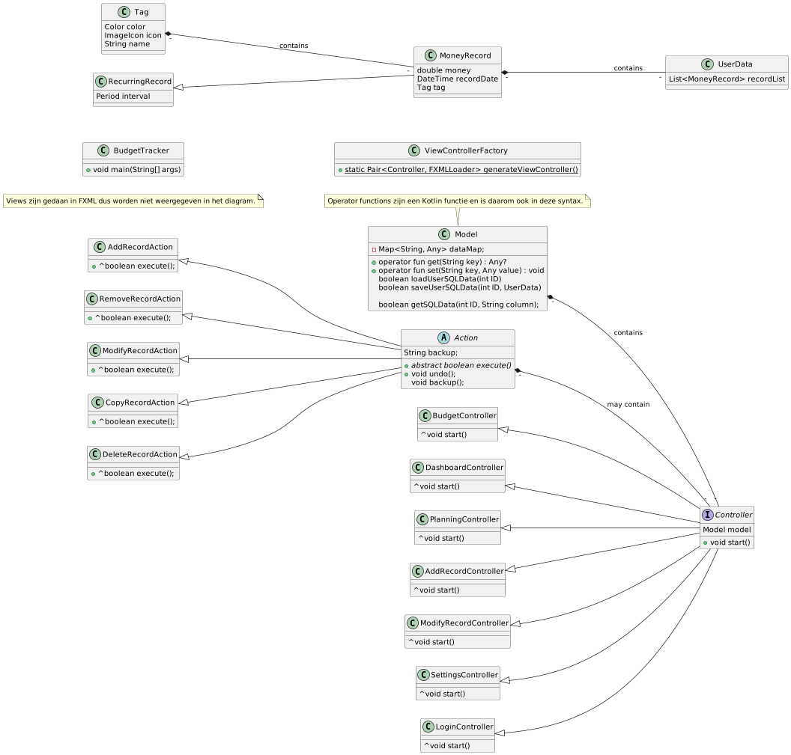

# Startdocument Design patterns - Budgettracker applicatie

Startdocument van **Monique Sabong**, **Rick Vinke** en **Thijs Janse**.

## Applicatie Beschrijving

Voor het vak design patterns wordt er een budgettracker applicatie gerealiseerd. De applicatie moet als hulpmiddel dienen
om overzicht te houden op financiële inkomsten en uitgaven. 

De applicatie zal ontwikkeld worden met **Java en Kotlin**.

## MosCow analyse

Must haves:

- Tags kunnen toevoegen. Het categoriseren
- Vaste uitgaven en inkomsten moet je voor de volgende maand kunnen inzien.
- Uitgaven en ingaven kunnen invoeren.
- Herhalende inkomsten en uitgaven kunnen instellen.
- Reminders in kunnen stellen.
- Filteren en sorteren op inkomsten en uitgaven. 
- Een limiet kunnen instellen voor maximale uitgaven.
- Je inkomsten kunnen verdelen in spaarpotjes bijvoorbeeld boodschappen, vrije tijd en vaste lasten. 

Should haves:

- Diagrammen als overzicht voor inkomsten en uitgaven.
- Het kunnen omzetten van verschillende currencies.
- Meerdere accounts
- Voor ieder account een pincode kunnen instellen.
- Exporteren en importeren van gegevens. 
- Adresboek

Could haves:
- Het aanpassen van icons aan inkomsten en uitkomsten. 
- Kleurtjes kunnen toevoegen.
- Emoticon toevoegen. Wanneer je bijvoorbeeld teveel geld heb spendeert, komt er een verdrietig gezichtje.
- Meerdere rollen (Admin, gebruiker)
- Inkomsten en uitgaven voorspelling, bijvoorbeeld loon.

Won't have:

- Geen aparte server

## Aangepaste musthave

Wegens tijdtekort en andere prioriteiten zijn de musthaves aangepast:

- Categoriseren van uitkomsten
- Vaste uitgaven moet je voor de volgende maand kunnen inzien.
- Uitgaven kunnen invoeren.
- Herhalende uitgaven kunnen instellen. (Werkt niet helemaal)
- Filteren en sorteren op inkomsten en uitgaven. 
- Een limiet kunnen instellen voor maximale uitgaven.
- Je inkomsten kunnen verdelen in verschillende budgets bijvoorbeeld boodschappen, vrije tijd en vaste lasten.

## Design patterns
Voor deze opdracht moeten er drie patterns gebruikt worden. Hierbij worden de volgende patterns gebruikt:

- Factory pattern. 
- Observer pattern. 
- Command pattern. 

## Klassendiagram

## Planning

Om de voortgang van dit project te bewaken, is er een planning gemaakt. Deze planning bevat in grote lijnen hetgeen waarmee wij ons bezig zullen houden per week tot de deadline. Er kan natuurlijk afgeweken worden van deze planning, maar het is het doel om deze in grote lijnen te volgen.

Dit project is begonnen op maandag 5 februari 2024 en zal eindigen op vrijdag 4 april 2024.

## Literatuurlijst

- 
